 
### - openCV Tutorial in Hindi:

[playlistLink](https://www.youtube.com/watch?v=0XD-N9-rzSI&list=PLTXuqKbKkxkTy764PhX1yil5hj-5va099&ab_channel=Aryanverma)

# -------------------------------------------01-------------------------------------------------

# Lecture-01:
- #### Introduction of the course:
   

# -------------------------------------------02-------------------------------------------------

# Lecture-02:
-   #### AI vs DL vs ML vs Computer-Vision:
-   `****`
   

# -------------------------------------------03-------------------------------------------------

# Lecture-03:
- ### What is openCV?

`openCV is a Open source programming library with real-time compouter vision capabilities.`

- ### BSD(Liscence) 
**Liscence**: Here we will know how openCV  change, redistribute and uses.
**It is free for both academic and commercial use**

- ### Modules of openCV
    - **Core:** This module is used for: basic core functions, Data structures, functionality to other moudules. **(Core Operation:)** addition, multiplication, subtraction etc. এই core operation গুলো অন্য moudles গুলোকে functionality provide করে বড় বড় task perform করার জন্য । `We already know that image is noting but the represtion of matrix form.`

    - **ImgProc:** Imgproc -> Image processing module. This module is used for color spaces, geometrical transforms, histograms, image filtering etc.

    - **DNN:** Deep Neural Network.

    - **ML:** Machine Learning uses: Regression task, Clustering tasks in images, anomaly detection and classicifation task.

    - **Video:** USED FOR, Video analysis including background subtraction, motion estimation and object-tracking algorithrms.

    - **highgui:** A high level UI module use for, Create and manipulate windows that can display images. Add trackbars to the windows, keyboard commands and handle mouse eveents.

    - **flann:** This moduleis used for 2D features framework. Thisi module includes feature detectors, descriptors and descriptor matchers.
    
    - photo
    - stiching
    - shape 
    - superres
    - videostab
    - viz
    - imgcodes
    - objdetect
    - features2d
    - calib3d
   

# -------------------------------------------04-------------------------------------------------
# Lecture-04:
### **Application:**
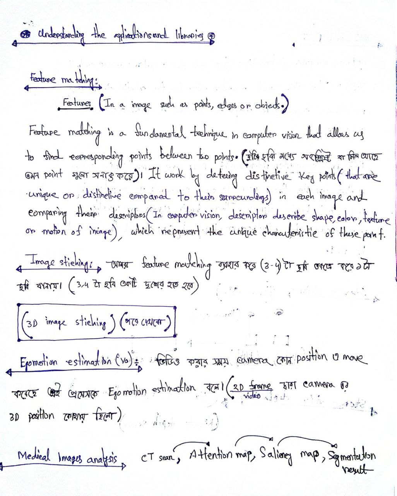
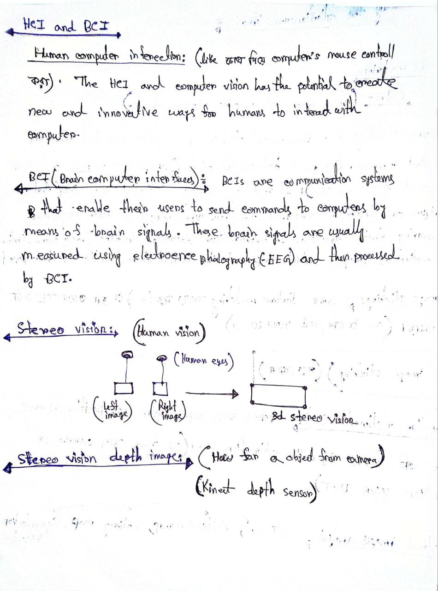
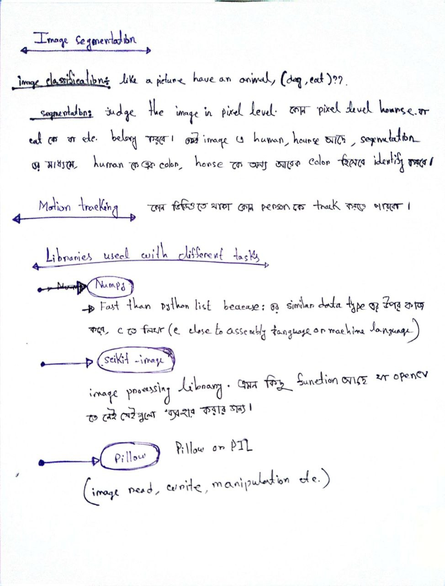
   

# -------------------------------------------05-------------------------------------------------
# Lecture-05:
### **Image:**
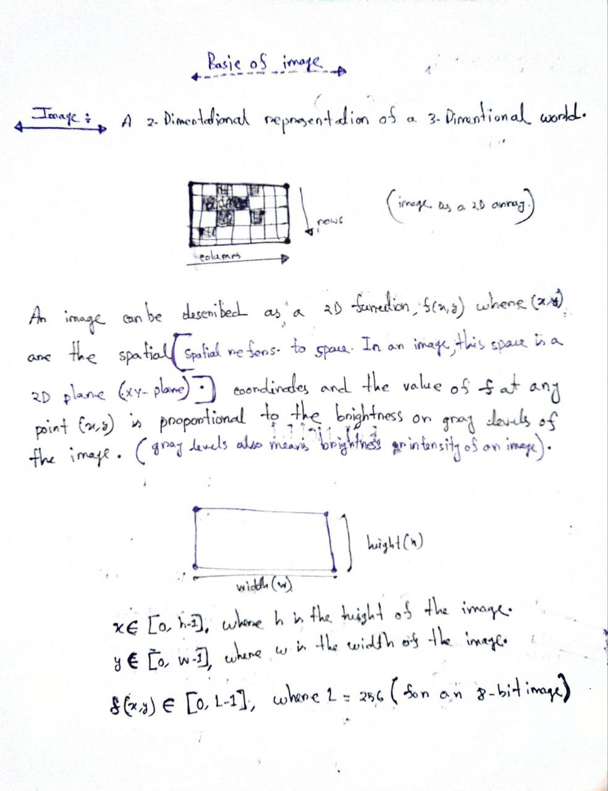
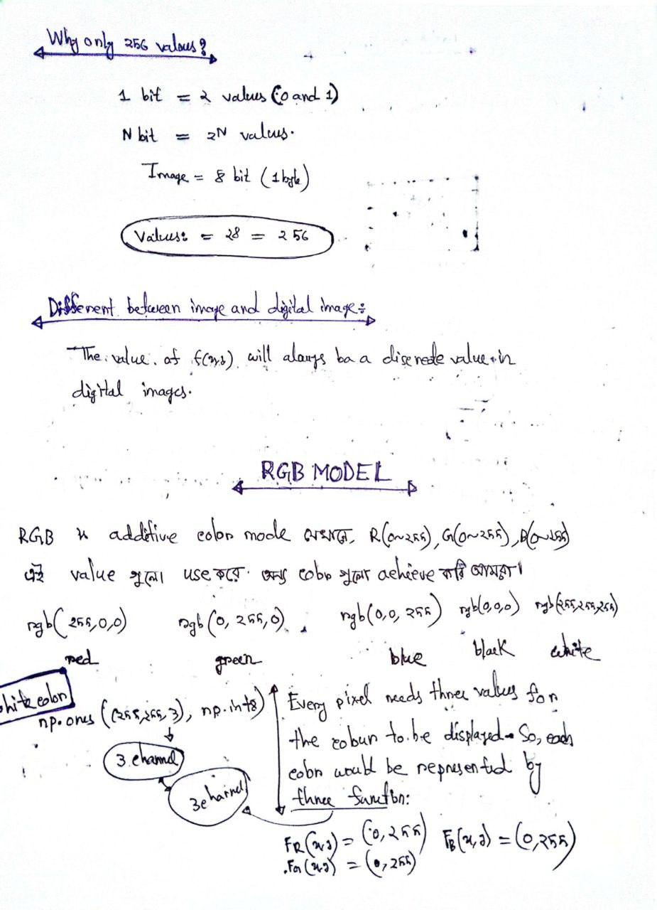
   

# -------------------------------------------06-------------------------------------------------
# Lecture-06:
### **Color Spaces:**
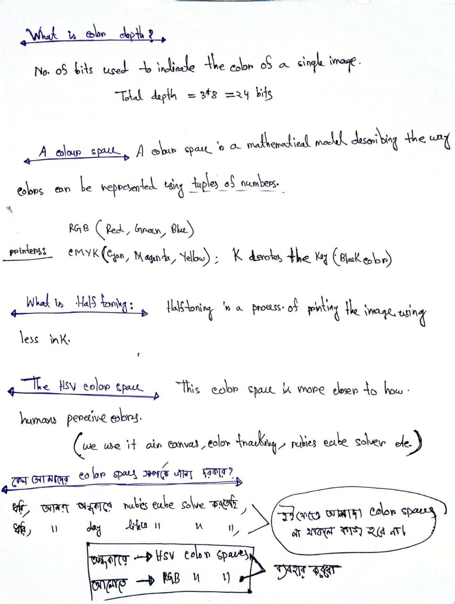
   

# -------------------------------------------07-------------------------------------------------

# Lecture-07:
### Numpy-1
   

# -------------------------------------------08-------------------------------------------------
# Lecture-08:
### Numpy-2
   

# -------------------------------------------09-------------------------------------------------
# Lecture-09:
### **Virtual Environment:**
`A Python virtual environment (venv) is simply a directory with a particular file structure.`
 
ধরি, আমি কোন প্রজেক্ট করবো সেখানে, একজায়গায় আমার python_openCV এর  4.8.0 আর অন্য project এ 4.9.1 লাগবে । 
এই ক্ষেত্রে আমাদের দুটি প্রজেক্টের dependency আলাদা আলাদা তাই  এক্ষেত্রে আমাদের virtual environment create করে কাজ করতে হবে । 
 

### **sys.argv[]:**
`SYS: System-specific parameters and functions.`
python test.py (parameter) যা ইচ্ছে তাই দিব এইগুলো argv[] এই  লিস্ট এর মধ্যে জমা হবে ।  
যেমনঃ এই খানে, শুরুতে filename then parameter গুলো সেভ হবে । 

### **Deactivate: venv**
`deactivate`
   

# -------------------------------------------10-------------------------------------------------
# Lecture-10:
`Image and video read Write`
   

# -------------------------------------------11-------------------------------------------------
# Lecture-11:
`Project: reverse a video.`
   

# -------------------------------------------12-------------------------------------------------
# Lecture-12:
`Work with shpae like: Lines, Shapes, Polygons, Text etc.`

### **Aliasing and Anti-aliasing:**
Aliasing and anti-aliasing are concepts related to image processing and computer graphics, particularly when dealing with digital images. They describe phenomena associated with the representation and processing of visual information. 
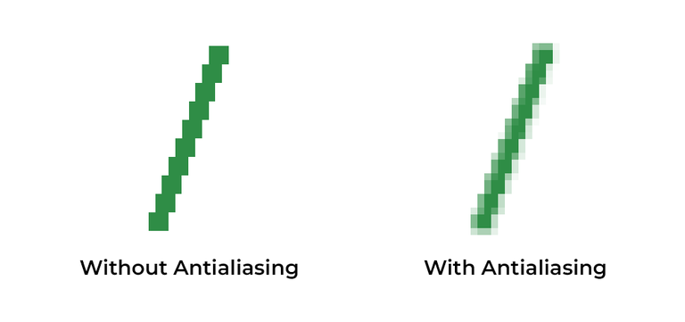
 

### **Aliasing:**
Aliasing occurs when there is an insufficient sampling rate to accurately represent a signal (such as an image or waveform)

### Anti-aliasing:**
Anti-aliasing is a technique used to reduce or eliminate aliasing artifacts in digital images. It involves applying various methods to smooth out jagged edges and reduce the visual impact of aliasing.
   

#### In openCV in line() function we have three line type:   i) line_4    ii) line_8    iii) line_AA
 

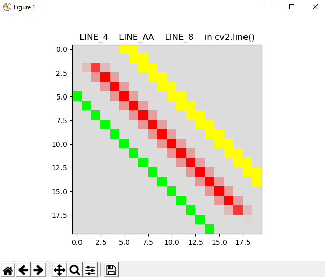

 

`line_4 and line_8 is aliasing.`  
`line_AA is anti-aliasing.`  
 

# -------------------------------------------13-------------------------------------------------
# Lecture-13:
`project: analog clock with openCV`

   

# -------------------------------------------14-------------------------------------------------

# Lecture-14:
### Rotation:
**Definition:** Rotation involves turning an object or image around a fixed point, known as the center of rotation.  
**Effect:** The image or object is rotated by a specified angle around the rotation center.  
**Mathematical Prove:**
Certainly! Let's derive the equations for a counterclockwise rotation in two dimensions using markdown language. 

### Roation করার জন্য আমাদের rotation matrix লাগবে যেইটা openCV তে implemented আছে । 
## Derivation of 2D Rotation Equations:
 

In the xy system, a point P is represented by polar coordinates $\((r, \alpha)\)$. In the x'y' system, after a counterclockwise rotation by an angle $\(\theta\)$, the polar coordinates become 
$\((r, \alpha - \theta)\)$.

Using trigonometric functions, the coordinates in the xy system are:

$\[
x = r \cos \alpha \quad (1)
\]$

$\[
y = r \sin \alpha \quad (2)
\]$

Now, applying trigonometric identities for differences, the coordinates in the x'y' system are:

$\[
x' = r \cos(\alpha - \theta) = r \cos \alpha \cos \theta + r \sin \alpha \sin \theta \quad (3)
\]$

$\[
y' = r \sin(\alpha - \theta) = r \sin \alpha \cos \theta - r \cos \alpha \sin \theta \quad (4)
\]$

Substituting equations (1) and (2) into equations (3) and (4), we get:

$\[
x' = x \cos \theta + y \sin \theta \quad (5)
\]$

$\[
y' = -x \sin \theta + y \cos \theta \quad (6)
\]$

These equations can be represented in matrix form as:

This matrix equation represents the standard form of a 2D rotation transformation.
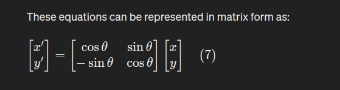

  

The inverse transformation is given by:

$\[
x = x' \cos \theta - y' \sin \theta \quad (8)
\]$

$\[
y = x' \sin \theta + y' \cos \theta \quad (9)
\]$

  

In matrix form:

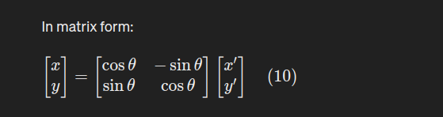

These equations describe the transformation and its inverse in a 2D space after a counterclockwise rotation by an angle $\(\theta\)$.

### proof: 
   
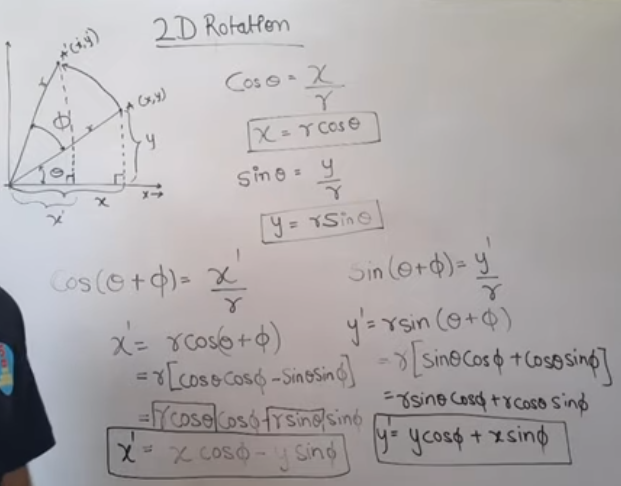
  
Clock wize হলে angle phi এর সামনে negative বসাবো । 
  
  

# Scaling: 

   

### Fast we will know about zooming:

- **Optical Zooming:** An Optical zoom means moving the zoom lens so that it increases the magnification of light before it even reaches the digital sensor.  

- **Digital Zooming:** A digital zoom is not really zoom, it is simply **interpolating** the image after it has been acquired at the sensor(pixilation process).  
  

## **Scaling:**
In OpenCV, scaling refers to the process of resizing an image, changing its dimensions while preserving its aspect ratio or adjusting the aspect ratio if necessary.  
`aspect ratio = Width/Height.`
 

### Process :
- Increasing or decreasing the pixels in digital image
- We have an image and we Increase it (180%) 
- then we resampling the image(**before interpolation picture:**   
আমরা যখন image এর height and width বাড়াবো তখন, pixel এর মধ্যেও  জায়গা  )
- then we assign new grayvalues(By the help of `Interpolation.`)
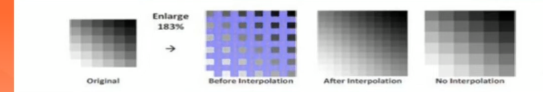

# `Interpolation: `
Interpolation is the process of estimating the values of a continous function from discreate samples. (আমরা জানি, image একটা function আর interpolation এর ক্ষেত্রে আমদের দুইটা পাশাপাশি pixel এর value দেওয়া আছে। কিন্তু আমাদের যেহেতু মাঝে space আসতেছে তাইলে এই space  এর মান বের করবো কিভাবে ?)
image function তাই, আমাদের যেহেতু দুইটা pixel এর মান জানা আছে তাই মাঝখানে কোন value তা বসতে পারে তা estimate করতে পারবো । 
 

**Each pixel in the image is represented by a vector v ∈ V indicating the location of that pixel, and it is paired with c ∈ C, which indicates the color of that pixel**
  

### openCV Give us 5 types of interpolation: 

- **Linear interpolation:**
- **Area**
- **Cuvic**
- **Nearest Neighbor Interpolation**
- **Sinusoidal Interpolation**

`Example of linear interpolation: `
 

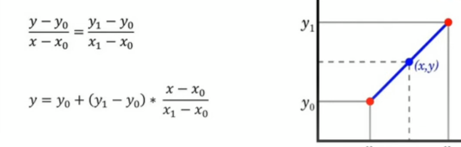

## Scaling matrix: 
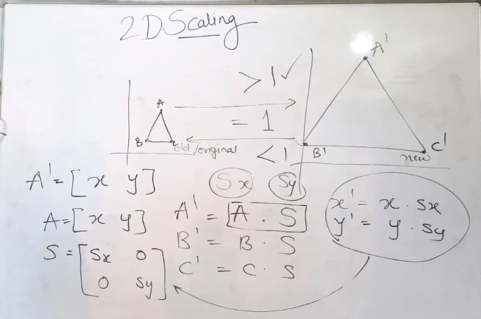

  

# **Image Translation:**
 

Shift an image in coordinate space by adding a specified value to the x and y coordinate.

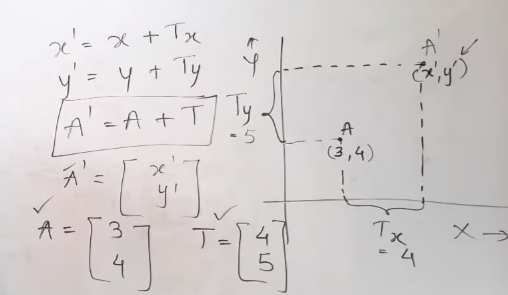

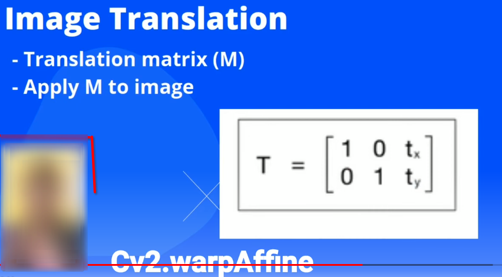

   

# -------------------------------------------15-------------------------------------------------

# Lecture-15:
   

# What is Geometric Transformation?
Geometric transformation refers to the process of changing the arrangement, size, and orientation of objects in a geometric space. Modify Special Relationship between pixels. Image can be shifted, rotated and streatched in muyltiple ways.

### Some common types of geometric transformations include:

- **Translation:** Moving an object from one location to another without changing its shape or orientation.

- **Rotation:** Turning an object around a fixed point, changing its orientation.

- **Scaling:** Changing the size of an object, either uniformly or along different axes.

- **Reflection:** Flipping an object across a line or plane, creating a mirror image.

- **Shearing:** Distorting an object by shifting its parts along parallel lines.

- **Affine Transformation:** A combination of translation, rotation, scaling, and shearing.

`Euclidean and projective transformations are specific types of geometric transformations with distinct characteristics:`

**Euclidean Transformation:**

**Properties:** Preserves distances and angles. Objects undergo translations, rotations, and reflections.

**Applications:** Used in computer vision, image processing, and computer graphics when maintaining geometric properties like distances and angles is crucial.

**Representation:** Typically represented by a combination of translations and rotations, often described using transformation matrices.

  

**Projective Transformation (or Perspective Transformation):**

**Properties:** Preserves straight lines but does not necessarily preserve angles, distances, or parallel lines. Objects undergo transformations that simulate perspective effects.

**Applications:** Widely used in computer graphics, computer vision, and image processing when dealing with scenes observed from a specific viewpoint.

**Representation:** Usually represented by a 3x3 matrix in homogeneous coordinates. Perspective transformations are common in applications such as 3D rendering, camera calibration, and augmented reality.

    

### **Projective Transformation (or Perspective Transformation):**

# Projective Transformation or Perspective Projection:

### [Video_Link](https://www.youtube.com/watch?v=2BIzmFD_pRQ&ab_channel=ComputerVisionwithH%C3%BCseyin%C3%96zdemir)

**Defination:** When we take photo with our camera, 3D scence is projected to 2D camera sensor. This mapping is called Perspective Projection.

 

একটা wall এর ছবি তুললাম ৩টা camera দিয়ে ৩ টা view point থেকে । 
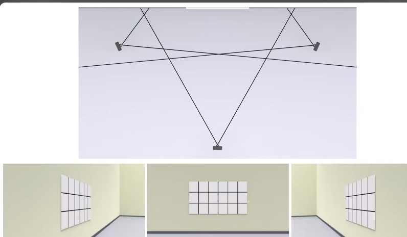
যদি আমরা মাঝখানের camera এর  grid টা বানাতে চাই left and right camera এর ছবি দিয়ে তখন আমরা 
projective transformation ব্যবহার করবো । 

# -------------------------------------------16-------------------------------------------------

# অনেক অনেক গুরুত্বপূর্ণঃ 

# Lecture-16:

# Convolutions and Filtering: 
 

## `Convolution:`
In convolution, we basically apply a mathematical operator to each pixel and change its value in some way. To apply this mathematical operator, we use another matrix called a kernel. 
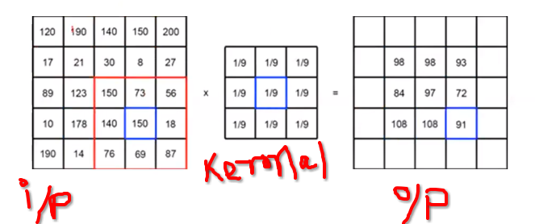

`Calculation:`
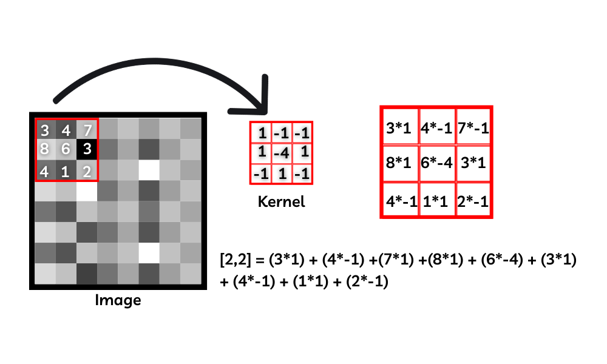

`কিন্তু আমরা যেহেতু, 3x3, 5x5 or oddxodd ব্যবহার করে  kernal এর middle point বরাবর output বসাচ্ছি, input এর শুরুতে যেইটা আছে সেইটা জন্য আমরা kearnal ব্যবহার করতে পারবো না । এর জন্য আমাদের padding with zero(i) এবং wrap around (ii). `

## `Frequency of a image: ` 

Frequency refers to the rate of change of pixel values. So we can say that the sharp edges would be **high frequency** content because the pixel values change rapidly in that region. Going by that logic, plain areas would be **low frequency** content.
  

`(যেমনঃ আমার  মাথার চুল আর মুখ যেইখানে মিলিত হয়েছে যেখানে(rate of change of pixel value বেশি) । কিন্তু যেইখানে শুধু চুল আর চুল সেইখানে (rate of change of pixel value কম ।)llow frequency reagion )।` 
  

**Low pass filter:** Low pass filter is the type of frequency domain filter that attenuates the high frequency components and preserves the low frequency components. 

**Low pass Filters:**
- It is used for smoothing the image.
- It attenuates the high frequency.
- It allows the frequency below cut off frequency to pass through it
- It helps in removal of aliasing effect.

### Some openCV function that uses low pass filter.
`cv.blur(), cv.GaussainBlur(), cv.medianBlur(), cv.bilateralFilter()` all these function use for 
bluring or smoothing the image.

 
 

**High pass filter:** High pass filter is the type of frequency domain filter that attenuates the low frequency components and preserves the high frequency components. 

**High pass Filters:**
- It is used for sharpening the image.
- It attenuates the low frequency.
- High frequency is preserved in it.
- It helps in removal of noise.

### Some openCV function that uses high pass filter.
`cv2.Laplacian(), cv2.Sobel(), cv2.Canny()` all these function use for detecting edge of the image.

 
 

# Applying Custom Filters to Image:
### Ex- Blurring an Image:

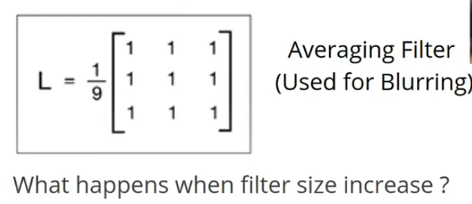

 
**Function Used:**
output = cv2.filter2D(src,depth,kernel,anchor,border_type)  

**Color depth in lecture: 06 -> No. of bits used to indicate the color of a single image. Total depth = 3*8 = 24 bits.**
**kernal: -> matrix we see in Convolution**  
**anchor:** In the cv2.filter2D() function in OpenCV, the anchor parameter represents the relative position of the anchor point within the kernel. The anchor point is the pixel in the kernel to which the convolution operation is applied to calculate the new value of the central pixel in the output image. 
**border_type:** we see the padding with zero and wrap around. And there are few more in openCV.

   

# Depth in details:

In OpenCV (Open Source Computer Vision Library), "depth" generally refers to the number of bits used to represent each pixel in an image or the datatype used to store pixel values. It determines the range of values that each pixel can take and is crucial for accurately representing images, especially when dealing with different types of images (grayscale, color, etc.) and processing operations.

In the context of OpenCV in Python, depth can be understood in a few different ways:

1. **Image Depth:** This refers to the number of bits used to represent each pixel in an image. Common depths include:
   - 8-bit unsigned integers (uint8): This is typical for grayscale images where pixel values range from 0 to 255.
   - 16-bit unsigned integers (uint16): Used in applications where more precision is needed, such as medical imaging.
   - 32-bit floating point numbers (float32): Used when high precision is required, especially in scientific and computational applications.

2. **Data Type in OpenCV:** When working with images in OpenCV, each pixel's value is stored according to a specific data type, which influences the range of values that pixel can take. For example:
   - `cv2.CV_8U`: Represents unsigned 8-bit images (0 to 255).
   - `cv2.CV_16U`: Represents unsigned 16-bit images (0 to 65535).
   - `cv2.CV_32F`: Represents floating point images.

3. **Channel Depth:** In the case of multi-channel images (such as RGB color images), the depth refers to the number of color channels (e.g., 3 channels for RGB images).

   

# -------------------------------------------17-------------------------------------------------

# Lecture-17:
   

# -------------------------------------------18-------------------------------------------------

# Lecture-18:
#  openCV Project: PHOTO to WATER COLOR ART

   

# -------------------------------------------19-------------------------------------------------

# Lecture-19:
#  openCV : 

   

# -------------------------------------------20-------------------------------------------------

# Lecture-20: Edge Detection(Sobel,Scharr,Laplacian)

## What is edge Detection?

`A high pass filtering operation.`

or

`The process of edge detection involves detecting sharp edges in the image and producing a binary image as the output. `

- `sharp edge:` where the intensity of pixel is changing rapidly not changing color we should give ans like this a an openCV Engineer.

- `Binary image: ` If we draw lines on a black background to indicate edges. 

 

`এখানে, কোন একটা pixel এ intensity হূট করেই change হচ্ছে । আমরা if-else condition দিয়ে এইটা define করতে পারবো না । কারণ, এখন যেই পয়েন্ট এ হয়েছে পরবর্তীতে সেইটা একটু দূরে হলে if-else কাজে আসবে না । তাই আমরা derivative use করবো, image intensity function এর । তাহলে সেই পয়েন্ট এ maximum value পাবো ।  `

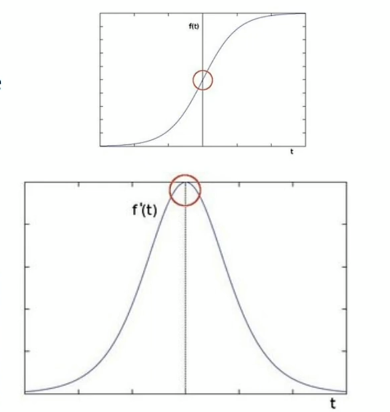

## Type of edge detection: 

- `sobel(sobelX and sobelY)`
- `Laplacian Filters`

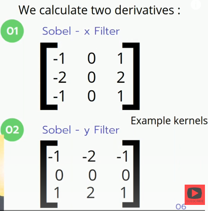

sobelX and sobelY এর kernal গুলো এমন ভাবে তৈরি করা যে, এরা image intensity function এর derivative খুব easily calculate করে edge detect করে । 

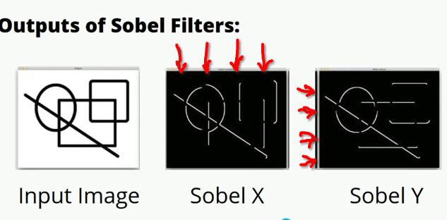

`sobelX: আমরা যদি উপর থেকে ছবিতে লাইট ফেলতে পারি  X-axis এর edge গুলো  ভালোভাবে detect হবে  ।  sobelX কে এইটার সাথে তুলনা করতে পারি । `

`sobelY: আমরা যদি ছবির পাশ থেকে লাইট ফেলতে পারি তাহলে Y-axis edge গুলো ভালোভাবে detect হবে । sobelY কে এইটার সাথে তুলনা করতে পারি । `

দুইটাকে merge করে আমরা একটা ভালো রেজাল্ট পাই । কিন্তু, আমাদের ছবিতে অনেক noise থাকে তাই sobel তেমন ভালো performance করে না । আমাদের  edge  গুলো অনেক মোটা হয়ে যায়  । এর develop version হিসেবে Laplacian এসেছে । 

  

# Laplacian Filter:

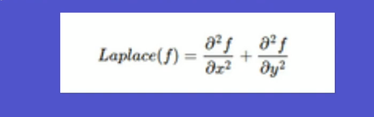

`Laplacian 2nd order derivative use করে । X-axis and y-axis  দুই direction  এই ।  `

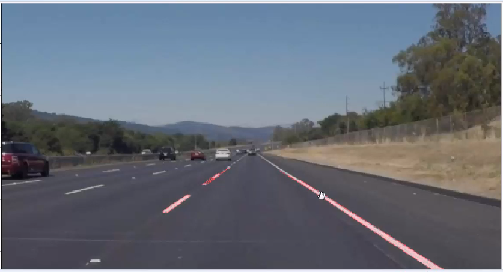

উপরের ছবিতে অনেক ধরনের ফলের slice করা আছে । কিন্তু, Laplacian দিয়ে করলে এইটার edge অনেক মোটা হয় । যার কারণে openCV তে আরো কয়েক ধরনের operation আছে যেইগুলো করা যায় না । পরের ছবিটা Canny Edge Detetion দিয়ে করা । যেইটাতে Edge গুলো অনেক বেশি  sharp হচ্ছে । 

   

# -------------------------------------------21-------------------------------------------------

# Lecture-21: Canny Edge Detection

## There are five steps in Canny Edge Detection:

i) Noise Reduction : `We know noise is the combination of high and low intensity value in an image.For edge detection we need to remove noise . Otherwise low-high intesity palce consider as a edge. We apply Gaussian filer to remove noise.`

ii) Gradient Calculation : `From sobelX and sobelY we calculate gradient or angle. This angle refer to the direction where the intensity of pixel changing. And gradient is always perpendicular to the edge. `

- `Gradient Direction: The gradient direction refers to the direction in which the intensity of the image changes most rapidly. This direction is perpendicular to the edge at that point. Essentially, the gradient points in the direction of the greatest rate of increase in intensity.`

- `Perpendicular to the Edge: The gradient vector (which has both magnitude and direction) is indeed perpendicular to the edge at each point. This means if you imagine an edge as a line across the image, the gradient vector points directly across the edge, from one side to the other.`

iii) Non-Maximum Supperession : ` শুরুতে আমরা sobel ব্যবহার করি । আমাদের  edge  গুলো অনেক মোটা হয়ে যায় sobelX and sobelY use করার কারণে । একে আমরা চিকন করি Non-Maximum Supperession এর মাধ্যমে । sobel এর মাধ্যমে আমরা যেই edge গুলো পায় আমরা Gradient এর সাহাযে সবগুলো edge point কে traverse করি আশে পাশের pixel গুলোর মধ্যে যাদের pixel এর মান ওঠানামা করছে তাদের color কে black করে দেয়া হয় ।  আর যারা থাকে তারাই সেই pixel গুলোয় হচ্ছে আমাদের  edge । `

iv) Double Thresholding : `For this step we need two threshold values, minVAl and maxVal. Any edges with intensity gradient more than maxVal are sure to be edges and those below minVal are non-edges, so discarded. Those who lie between these two thresholds are classified, edges or non-edge based on their connectivity (in the next setp).`

v) Edge Tracking by Hysteresis: `আমাদের যেই Edge গুলো threshold minVAl and maxVAL এর মাঝখানে পড়ে তাদের সাথে যদি কোন Edge এর connectivity থাকে তাহকে তাদেরকে edges আর না থাকলে non-edge হিসেবে গণ্য করা হয় ।   `

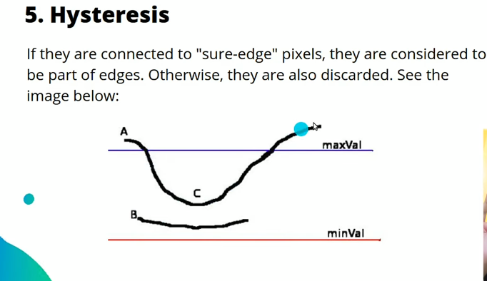

   

# -------------------------------------------22-------------------------------------------------

# Lecture-22:
#  openCV :

   

# -------------------------------------------23-------------------------------------------------

# Lecture-22:
#  openCV :

   

# -------------------------------------------24-------------------------------------------------

# Lecture-22:
#  openCV :

   

# -------------------------------------------25-------------------------------------------------

# Lecture-25:
- `A theoretical introduction to histrogram.`
- `Image Histrogram.`
- `Grayscale Histrogram.`
- `What is brightness.`
- `Color Histrogram.`
- `Histrogram Equalization.`

### Histrogram:

`A histogram is a bar graph-like representation of data that a range of outcomes into columns along the x axis and the number of count or frequency in the y-axis.`

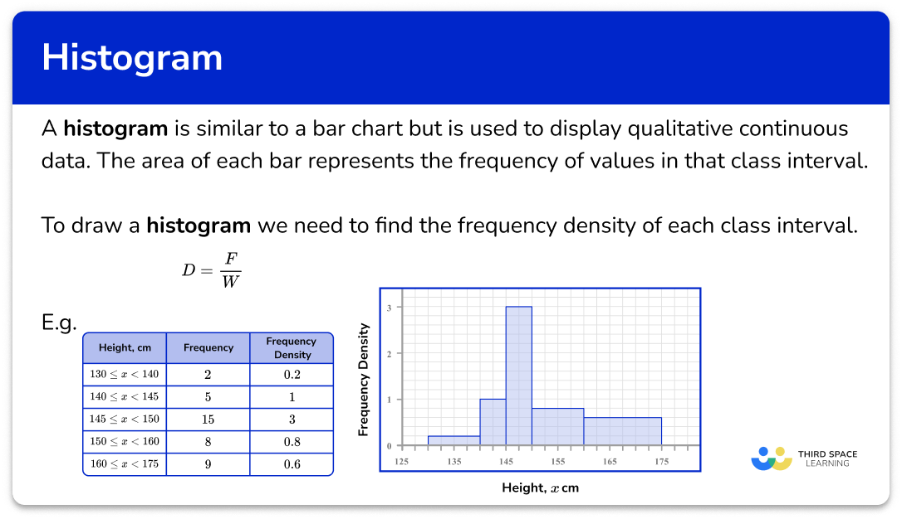

 

### What is a image Histrogram:

`An image histogram is a graphical representation of the number of pixels in an image as a function of their intensity.`
 

`Histograms are made up of bins, each bin representing a certain intensity value range. The histogram is computed by examining all pixels in the image and assigning each to a bin depending on the pixel intensity. The final value of a bin is the number of pixels assigned to it. The number of bins in which the whole intensity range is divided is usually in the order of the square root of the number of pixels.`

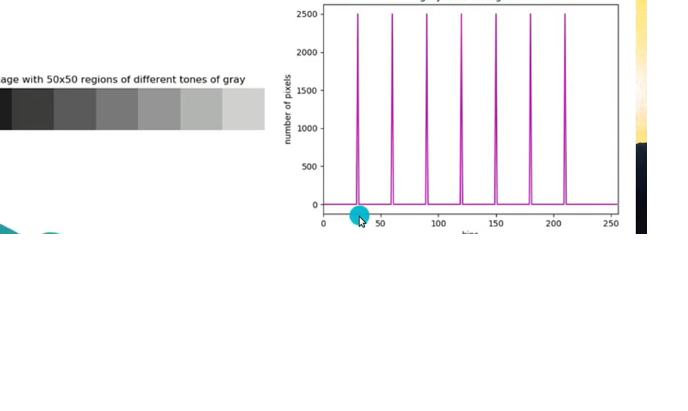

**Frequency:** The number of pixels for each intensity value is called frequency.

**Bins:** The histograms show the number of pixels (frequency) for every intensity value, ranging from 0 to 255. Each of these 256 values is called a bin in histogram terminology.

 

### What is brightness:

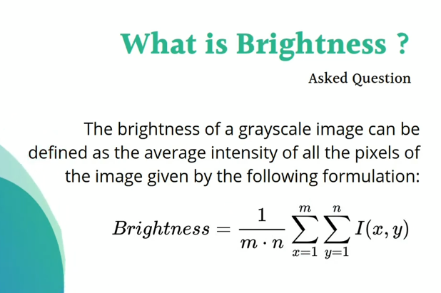

`m is the number of column and n is the number of row. I(x,y) Intensity value of that pixel.`

 

### Histrogram for gray scale image:

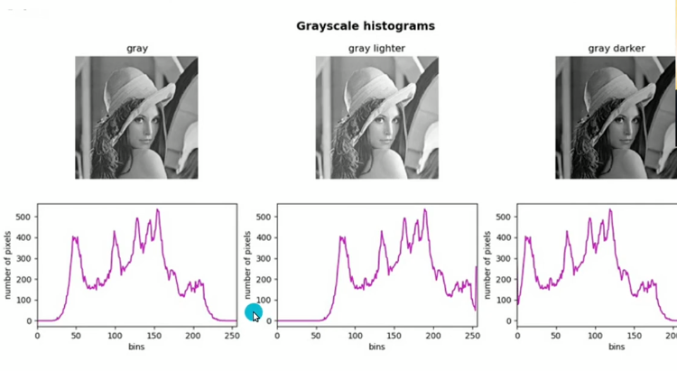

`1st graph is for a gray scale image. If we increase the brightness then the graph shifted in the positive direction and if we decrease the brightness(draken the image) then the graph shifted i the negative direction.`

### How to find the optimam value of the shifted graph? 

- ` By the help of histrogram equalization.`

 

### For colord image: 

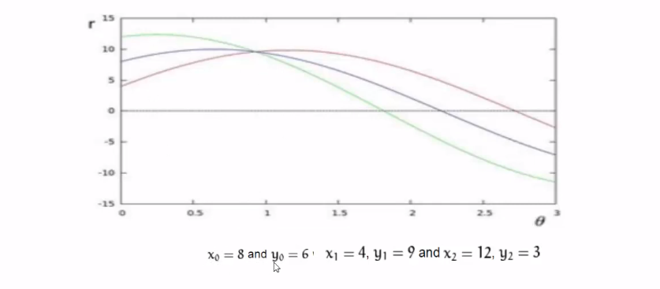

 

### Histrogram Equlization:

#### for gray scale image:

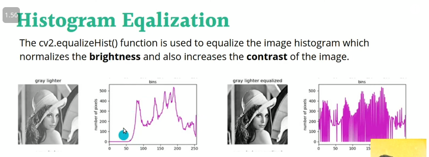

`Here, in first image we have no distribution in the range(0~50) but after appling the histrogram equalization the distribution become in the range(0~255). As the 2nd image distribution range(0~255) it's give us more contrast image.`

#### for colored image:

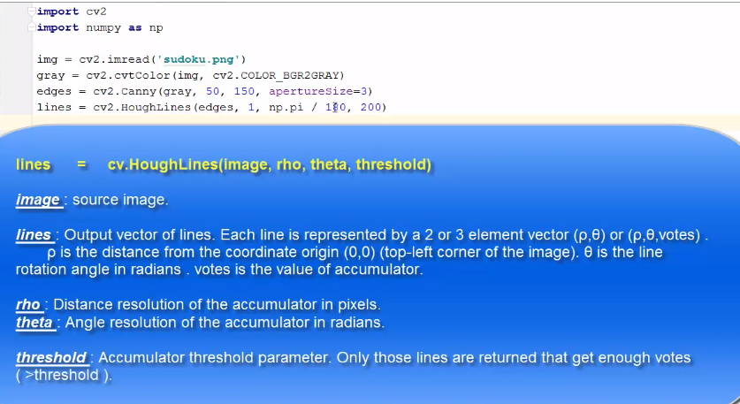

`First, we seperate the each color channel then we apply the historgam equalization.`

 

`But histrogram equalization is not the best aproach. We will see better aproach in the next lecture.`

   

# -------------------------------------------26-------------------------------------------------

# Lecture-22: 

- `AHE: Adaptive Histrogram Equalization.`
- `CLAHE : Contrast Limited Adaptive Histrogram Equalization.`

 

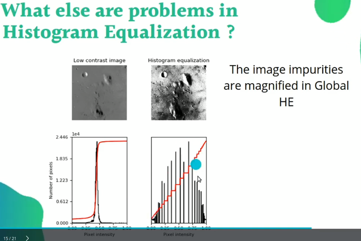

`আমরা আগের এ দেখেছি যদি Histrogram Equalization ব্যবহার করলে distribution এর range(0~255) হয় । এর ফলে ছবির contrast বাড়ে । উপরের ছবিতে Contrast এমন ভাবে বেড়ে গেছে যে ছবিতে অনেক চলে এসেছে । এর জন্য আমরা AHE ব্যবহার করি । AHE এ আমাদের ছবি গুলোকে আমরা অনেক গুলো ভাগ করি তারপর আমরা সেখানে Histrogram Equalization ব্যবহার করি । এর ফলে আমাদের ছবিঃ `

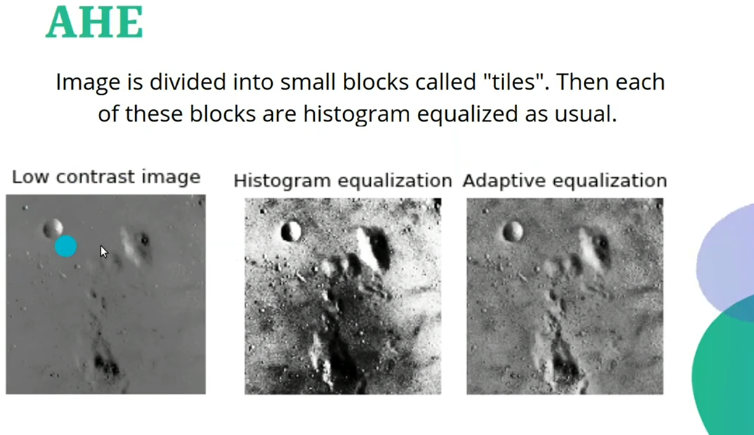

 

### Problem with AHE:

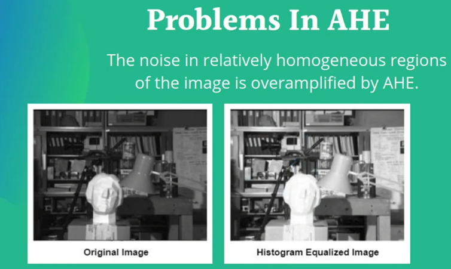

`This is the original image. Here, this is its histogram equalization image. If you see this, there is a small statue placed in the middle. The eyes, nose and mouth of the statue are not visible but histogram equalization. According to histrogram equalizaton, the contraption is cement, which means its eyes, nose, ears and mouth should have been more visible, but what happened here, it became dirty and if I use adaptive histrogram equalization is become more dirty.`

For this problem we need CLAHE(Contrast Limited Adaptive Histrogram Equalization)

 

   

