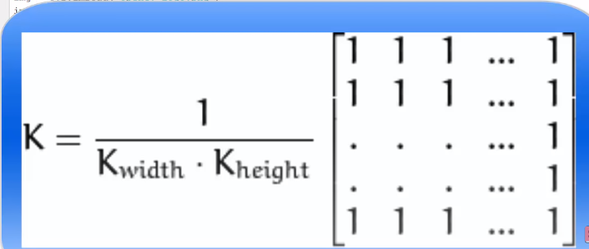
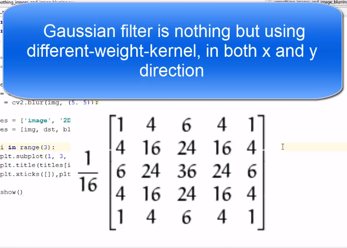
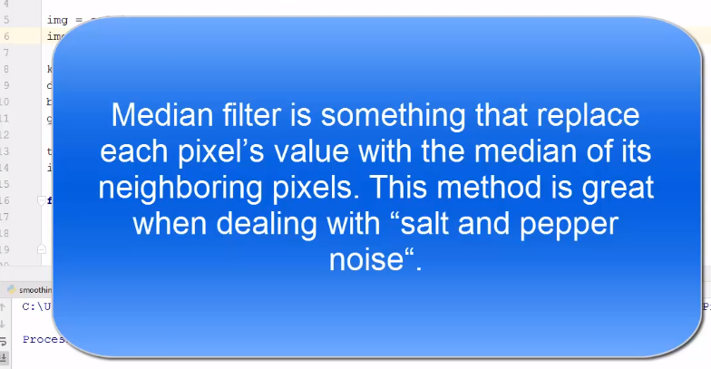

`When smoothing or blurring images we can use diverse linear filters because linear filters are easy to achieve and are also relatively fast now there are various kinds of filters available in open CV for example:` 

- homogeneous
- gaussian
- median 
- bilateral 

#### First of all we will see the homogeneous filter :
so, homogeneous filter is the most simple filter and in homogeneous filter **each output pixel is the mean of its kernels neighbors** now in homogeneous filter all pixels contribute with the equal weight and that's why they are called homogeneous filters And **a kernel is a shape which we can apply or convolve over an image.`** In homogenous filter we use kernel given in the below:
  

 

# Kernel for Gaussian filter:

# median blur : 

 
