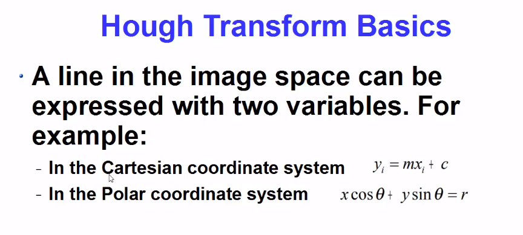
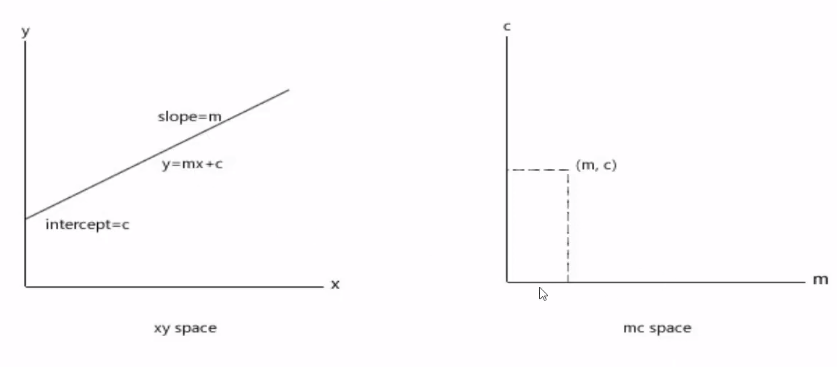
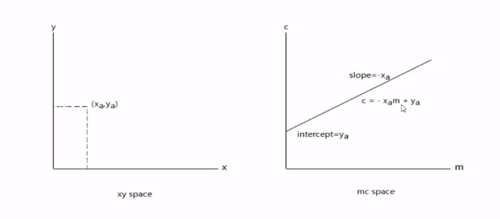
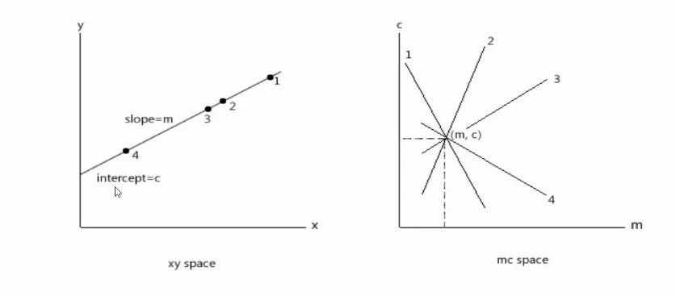
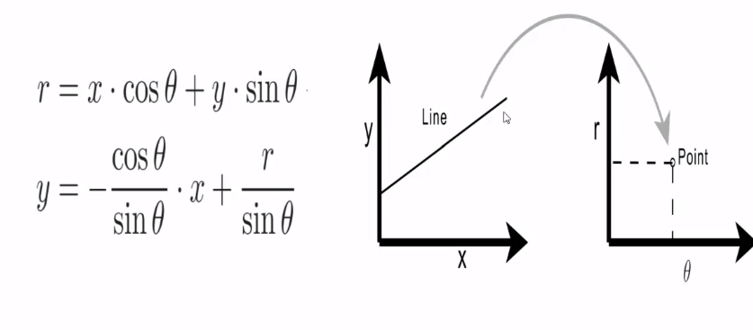
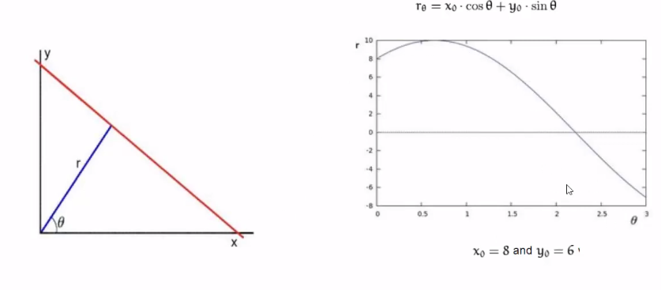
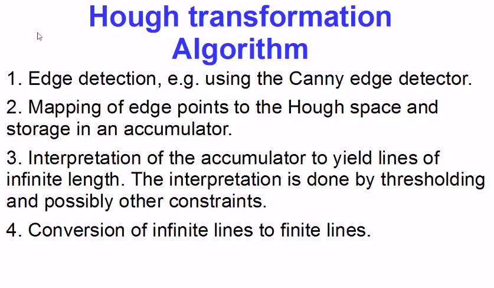

# Lecture 28: `Hough Line Transform`

Hough Transform is a popular technique to detect any shape if you can represent that shape in a mathematical form Hough transform can detect the shape even if it is broken or distorted a little bit.

`You have an image of a road and you want to detect these lane lines in this road image so the first step in order to detect these Lane lines in this road is to find the edge pixels using canny edge detection or any other edge detection method now after you found out the edges using any edge detection method you want a geometrical representation of that edge and in order to find out the geometrical representation for example you want to find out the slope of this edge or its intercept you can use half transform to represent these pixels or edges in the mathematical or geometrical form so after you find out the edges using any edge detector you just have the sequence of pixels so you can loop through all the pixels and somehow figure out the slope and intercepts but it's a very difficult task so we want some mechanism that gives more weight age to pixels that are already in line and this is what we can achieve using Hough transform.`

 

# Basic of Hough Line Transform:

A line can be represented by two equation i) Cartesian and ii) Polar . 

In, cartesian we can represented the line in `xy space` and `mc space` 

If we have two point in `xy space, Xa and Ya` then the equation of the line in `mc space` given below,

If we have sevral point of a line in `xy space` then in `mc space` the m and c is same for all but the line is different.

In polar codinate system:

Given, a point in `xy space` (8,6)  then the line represtation in  `r theta space`  is:

for multiple lines:

And in the `r theta sapce ` the intercept represent a line in hough space.

 

# Algorithrm of hough line transformation 

 

`OpenCV implements two kind of half line transforms the first is the standard Hough transform which is done using HalfLines method the second type is the probabilistic half line transform which is done by HalfLinesP method. `

